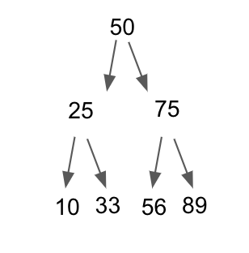
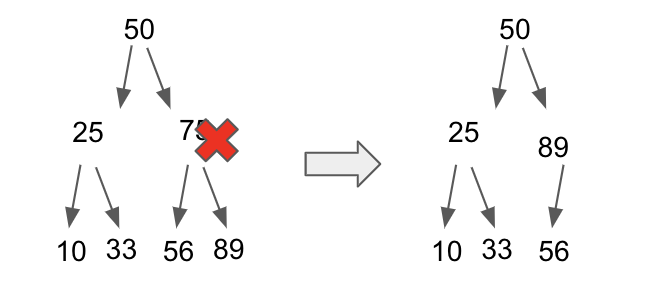
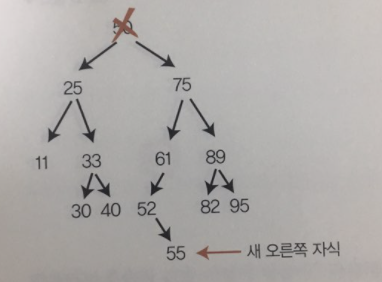
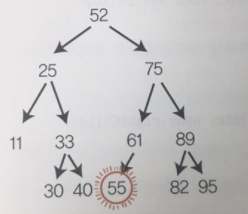

## 이진 트리

정렬된 배열의 삽입과 삭제는 느리다. 
> 정렬된 배열에 값을 삽입할 때마다 그 값보다 큰 값을 오른쪽으로 시프트해야 함

해시테이블의 검색 삽입 삭제는 O(1) 이지만 **심각한 단점**이 있다.
> 순서를 유지하지 못한다.

### 트리의 규칙
 * 각 노드의 자식은 0개나 1개, 2개다
 * 한 노드에 자식이 둘이면 부모보다 작거나 커야한다.

### 검색 O(log N)
> 최악 O(N)

이진 트리를 검색하는 알고리즘은 **루트 노드**부터 시작한다

1. 노드의 값을 확인한다.
2. 찾고 있는 값이면 좋다
3. 찾고 있는 값이 작다면 왼쪽 검색
3. 찾고 있는 값이 크다면 오른쪽 검색

### 삽입 O(log N)
> 최악 O(N)

정렬된 배열보다 이진 트리가 뛰어난 연산은 삽입이다.

### 삭제
이진 트리에서 가장 어려운 연산이다.

#### 삭제 규칙
* 삭제할 노드에 자식이 없으면 그냥 삭제
* 삭제할 노드에 자식이 하나면 노드를 삭제하고 그 자식을 삭제된 노드가 있던 위치이 넣는다
* 자식이 둘인 노드를 삭제할때는 삭제된 노드를 후속자 노드로 대체한다. 
>후속자 노드란 삭제된 노드보다 큰 값 중 최솟값을 갖는 자식 노드다.

만약 후속자 노드에 오른쪽 자식이 있으면 후속자를 삭제된 노드가 있던 자리에 넣은 후, 후속자 노드의 오른쪽을 후속자 노드의 원래 부모의 왼쪽 자식으로 넣는다.

