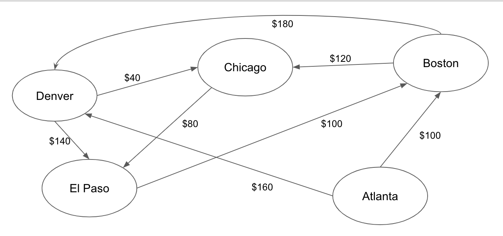
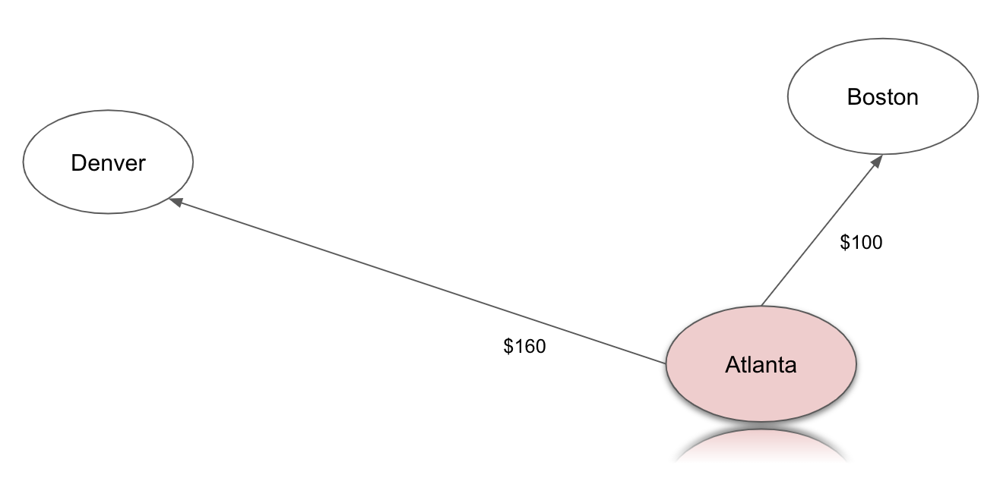
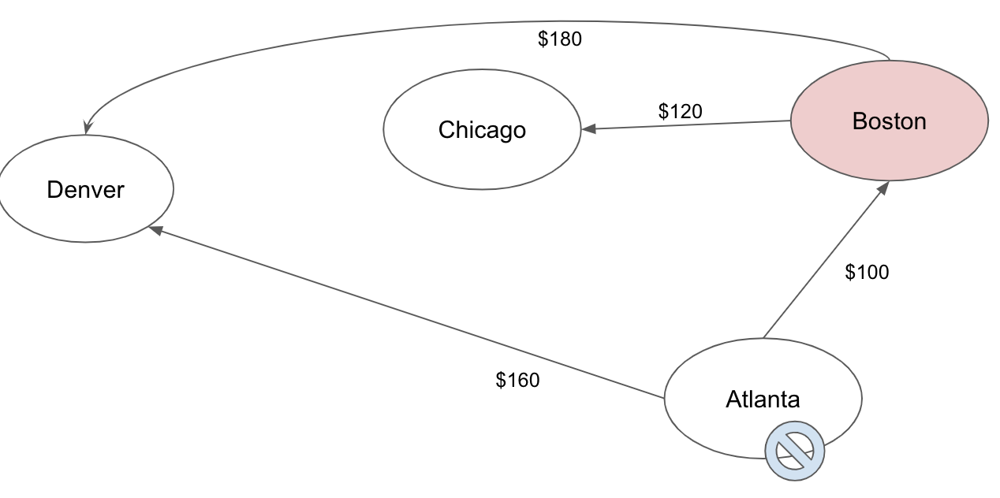
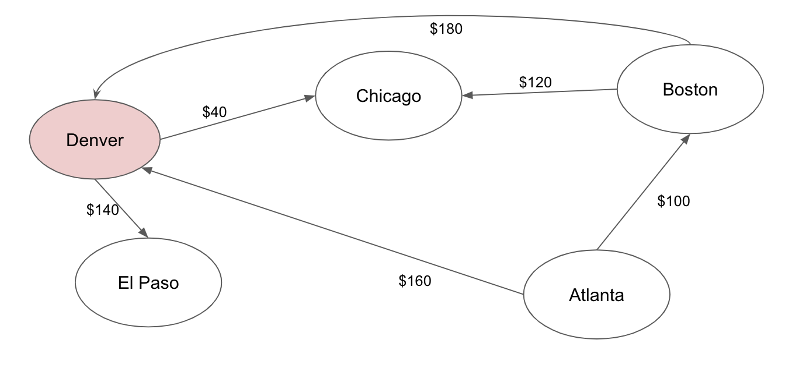
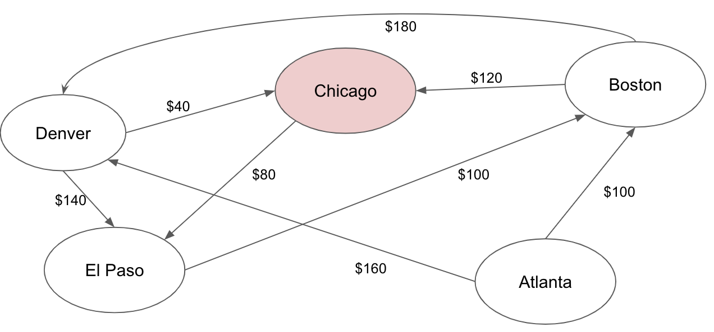

## 그래프

### 페이스북 친구 데이터 구조 예제

#### 배열
```java
relationships = [
["Alice", "Bob"],
["Bob", "Cynthia"],
["Alice", "Diana"],
["Bob", "Diana"],
["Elise", "Fred"],
["Diana", "Fred"],
]
```
하지만 앨리스의 친구가 누구인지 빠르게 알 수 없다. O(N)

#### 해시 테이블
```java
friends = {
        "Alice" => ["Bob", "Diana", "Fred"],
        "Bob" => ["Alice", "Diana", "Fred"],
}
```

그래프를 구현하는 방법중 하나는 해시 테이블을 사용하면 빠르게 친구를 알 수 있다. O(1)

### 너비 우선 탐색

효율성은 O(V + E) 라고 한다. 

1. 현재 정점과 인접한 각 정점을 방문. 이전에 방문한 적이 없다면 방문했다고 표시하고 큐에 추가
2. 현재 정점에 인접한 정점을 모두 방문했으면 큐로부터 다음 정점을 제거해서 현재 정점으로 만든다.
3. 현재 정점에 인접한 정점을 모두 방문했고 큐에 더 이상 정점이 없으면 알고리즘을 종료한다.

### 데이크스트라 알고리즘
최단 경로 문제를 푸는 알고리즘
1. 시작 정점을 현재 정점으로 한다.
2. 현재 정점에 인접한 모든 정점을 확인해서 시작 정점으로부터 알려진 모든 위치까지의 가충치를 계산하고 기록한다. 
3. 다음 현재 정점을 결정하려면 시작 정점으로부터 도달할 수 있는 방문하지 않은 가장 저렴한 알려진 정점을 찾는다.
4. 그래프 내 모든 정점을 방문할 때까지 1~3단계를 반복한다. 

#### 애틀랜타 -> 엘패소


| 애틀랜타부터 | 보스턴 | 시카고 | 덴버 | 엘패소 |
|--------------|--------|--------|------|--------|
|              |?|?|?| ? |

##### Step 1


| 애틀랜타부터 | 보스턴 | 시카고 | 덴버 | 엘패소 |
|--------------|--------|--------|------|--------|
|              | $100 |?|$160| ? |


##### Step 2


| 애틀랜타부터 | 보스턴 | 시카고 | 덴버 | 엘패소 |
|--------------|--------|--------|------|--------|
|              | $100 | $220 |$160| ? |

##### Step 3


| 애틀랜타부터 | 보스턴 | 시카고 | 덴버 | 엘패소 |
|--------------|--------|--------|------|--------|
|              | $100 | $200 |$160| $300 |

##### Step 4


| 애틀랜타부터 | 보스턴 | 시카고 | 덴버 | 엘패소 |
|--------------|--------|--------|------|--------|
|              | $100 | $200 |$160| $300 |

##### Step 5


| 애틀랜타부터 | 보스턴 | 시카고 | 덴버 | 엘패소 |
|--------------|--------|--------|------|--------|
|              | $100 | $200 |$160| $280 |