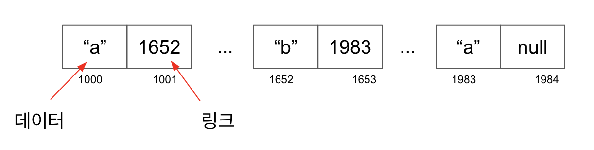
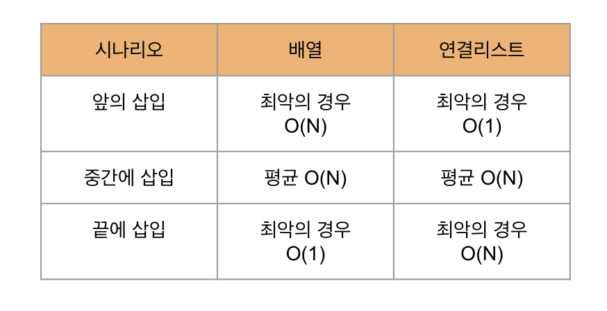
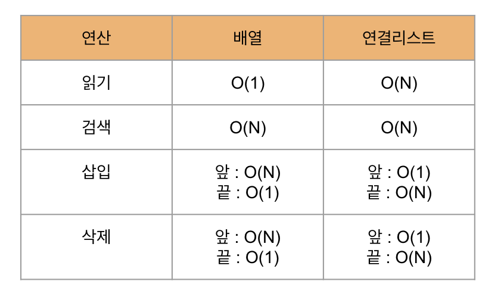
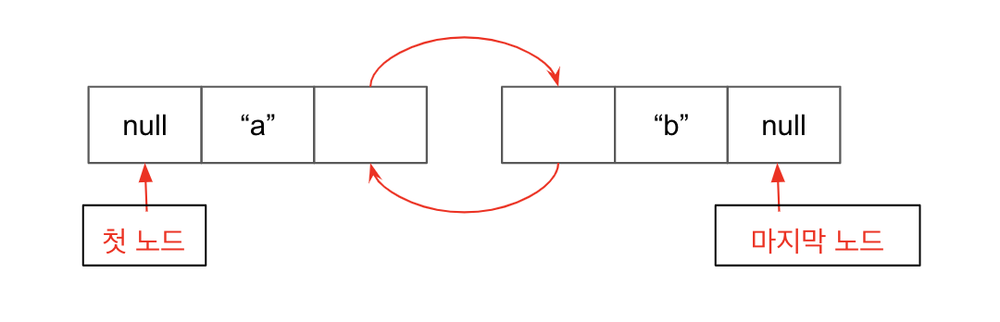

## 연결리스트

> 마지막 노드는 "null" 로 끝난다

연결리스트가 배열보다 좋은 점은 서로 인접하지 않은 여러 셀에 걸쳐 데이터를 저장할 수 있다.
하지만 연결리스트의 효율성은 O(N) 이다 O(1) 이 읽기에 비해 심각한 단점이 있다. 

### 읽기
연결리스트 O(N) 배열 O(1)

### 검색
배열과 연결 리스트는 검색 효율성이 같다. O(N)

### 삽입 

### 삭제
삽입과 같다

### 정리 

## 이중 연결 리스트

첫 노드와 마지막 노드를 알고 있으므로 
**삽입 삭제는 O(1)이 된다.**