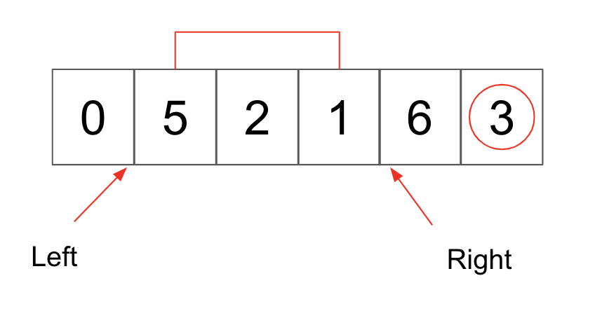
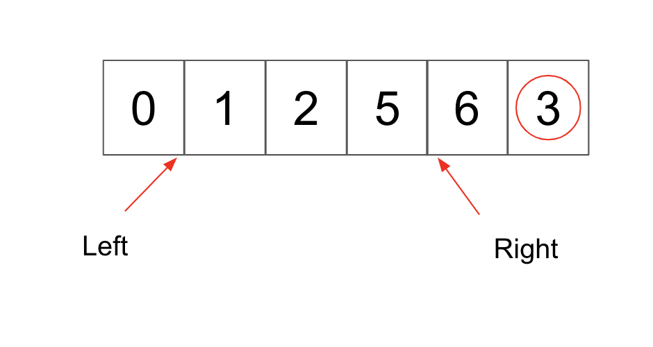
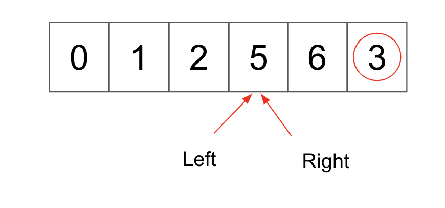
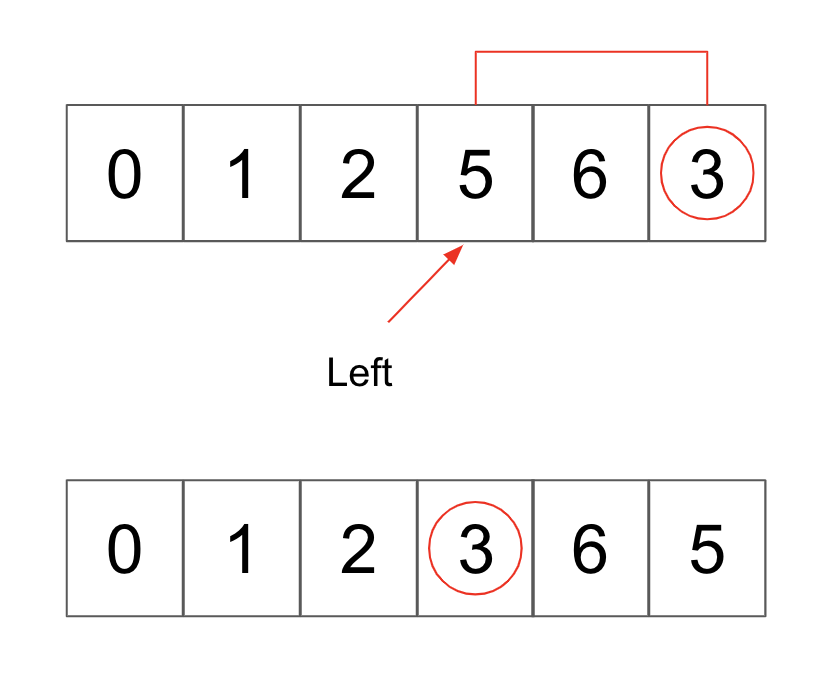
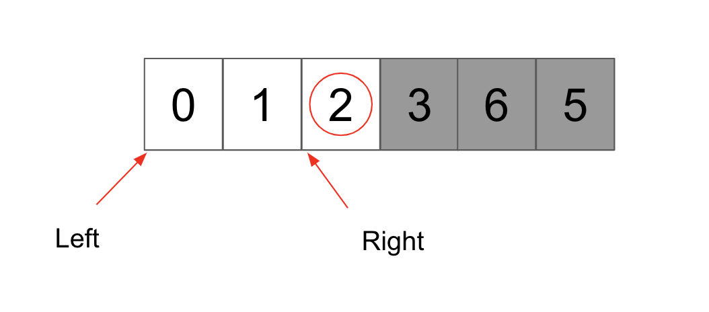
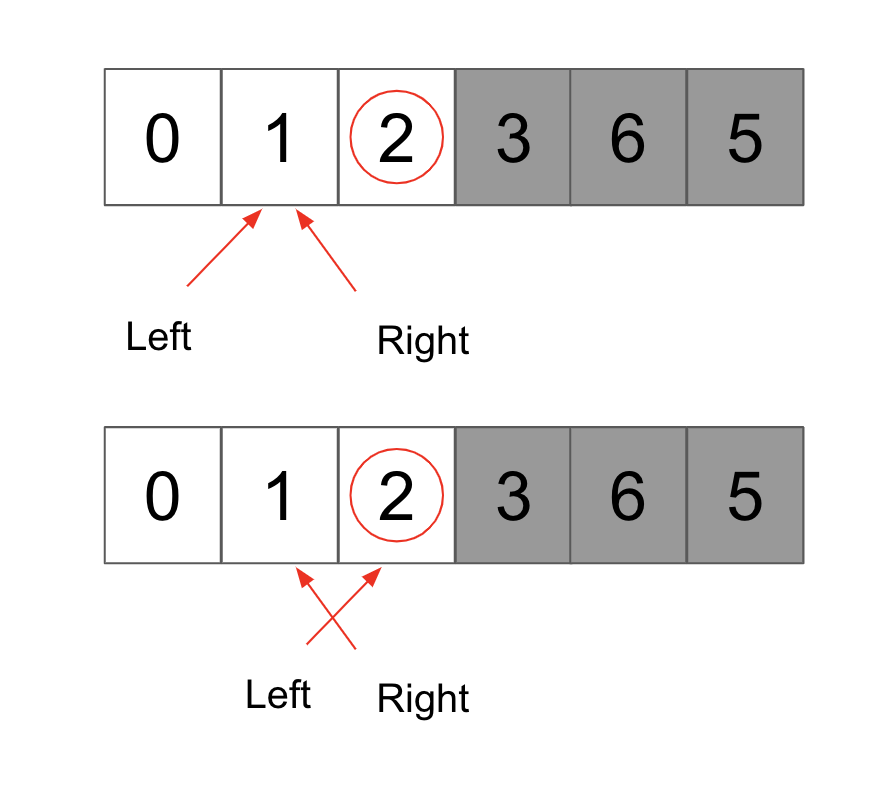
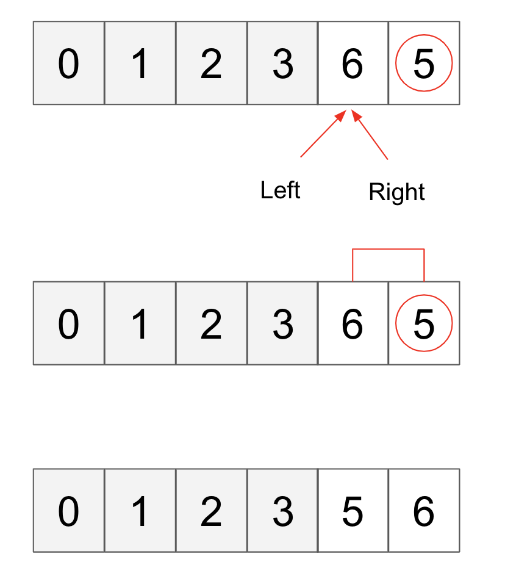

## 분할
분할이라는 개념은 **피벗**을 기본으로 한다.

Left: left <= pivot 
1. 왼쪽 포인터를 한 셀씩 계속 __오른쪽__으로 옮기면서 **피벗보다 **크거나 같은 값**에 도달하면 멈춘다.

Right: right >= pivot
2. 오른쪽 포인터를 한 셀씩 계속 __왼쪽__으로 옮기면서 피벗보다 작거나 같은 값에 도달하면 멈춘다

3. 왼쪽 포인터와 오른쪽 포인터가 가리키고 있는 값을 교환한다.

4. 두 포인터가 가리키는 값이 같거나 넘어갈때 까지 반복한다.

5. 끝으로 왼쪽 포인터와 피벗을 교환한다. 

완벽히 정렬되진 않았지만 피벗은 올바른 위치에 자리하게 됬다.

## 퀵 정렬
분할의 과정을 이어서 설명한다.

### Left
분할의 과정을 거치면서 피벗을 최종적으로 올바른 위치에 있다.

임의의 피벗을 선택한다. 

Left의 1은 피벗보다 작기 때문에 한칸 더 옮긴다. 

Left는 피벗과 동일한 값이기 떄문에 포인터를 멈춘다.

### Right

### 삽입정렬 VS 퀵 정렬

## 퀵 셀렉트
퀵 정렬과 이진 검색의 하이브리드
> 분할을 하면 피벗은 자신의 자리를 잡기 때문에 전체를 정렬하지 않아도 값을 찾을 수 있다.

퀵 정렬은 배열을 반으로 나눌때 마다 원래 배열의 모든 셀을 다시 분할해야 하므로 O(N log N) 이 걸린다. 
퀵 셀렉트는 **배열을 반으로 나눌 때마다 필요한 반쪽**만 분할하면 된다. 
