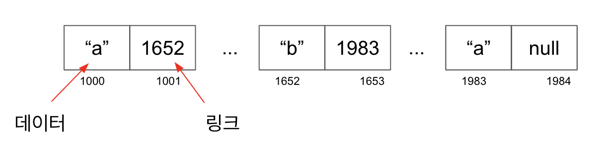
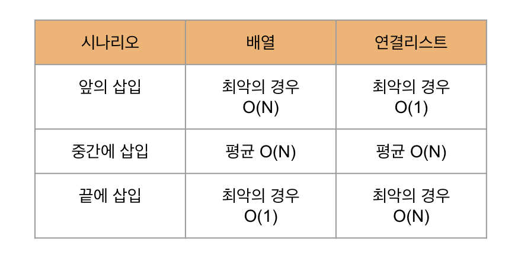
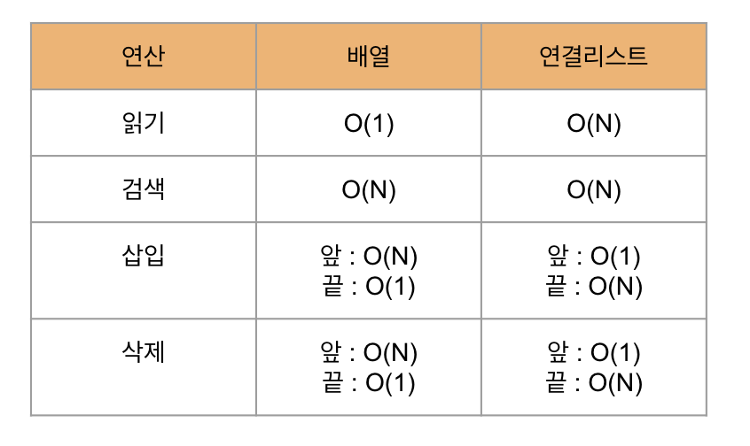

# 알고리즘 정리

## Set
Set 은 잘 사용하지 않는 것이 좋다. 
그 이유는 삽입의 시간복잡도가 O(N)이기 때문이다.

우선 배열안에 값이 존재하는지 검사를 한 후 
존재하지 않다면 삽입을 한다.
 
## 재귀
**재귀를 사용한다고 해서 loop 보다 성능이 좋아지는 것은 아니다.**
하지만 하위~하위~하위와 같은 파일 시스템 구조에서 사용하는 것에 적합하다.

## 분할
분할이라는 개념은 **피벗**을 기본으로 한다.

Left: left <= pivot 
1. 왼쪽 포인터를 한 셀씩 계속 __오른쪽__으로 옮기면서 **피벗보다 **크거나 같은 값**에 도달하면 멈춘다.

Right: right >= pivot
2. 오른쪽 포인터를 한 셀씩 계속 __왼쪽__으로 옮기면서 피벗보다 작거나 같은 값에 도달하면 멈춘다

3. 왼쪽 포인터와 오른쪽 포인터가 가리키고 있는 값을 교환한다.

4. 두 포인터가 가리키는 값이 같거나 넘어갈때 까지 반복한다.

5. 끝으로 왼쪽 포인터와 피벗을 교환한다. 

완벽히 정렬되진 않았지만 피벗은 올바른 위치에 자리하게 됬다.

## 퀵 정렬
분할의 과정을 이어서 설명한다.

### Left
분할의 과정을 거치면서 피벗을 최종적으로 올바른 위치에 있다.

임의의 피벗을 선택한다. 

Left의 1은 피벗보다 작기 때문에 한칸 더 옮긴다. 

Left는 피벗과 동일한 값이기 떄문에 포인터를 멈춘다.

### Right

### 삽입정렬 VS 퀵 정렬

## 퀵 셀렉트
퀵 정렬과 이진 검색의 하이브리드
> 분할을 하면 피벗은 자신의 자리를 잡기 때문에 전체를 정렬하지 않아도 값을 찾을 수 있다.

퀵 정렬은 배열을 반으로 나눌때 마다 원래 배열의 모든 셀을 다시 분할해야 하므로 O(N log N) 이 걸린다. 
퀵 셀렉트는 **배열을 반으로 나눌 때마다 필요한 반쪽**만 분할하면 된다. 

## 연결리스트

> 마지막 노드는 "null" 로 끝난다

연결리스트가 배열보다 좋은 점은 서로 인접하지 않은 여러 셀에 걸쳐 데이터를 저장할 수 있다.
하지만 연결리스트의 효율성은 O(N) 이다 O(1) 이 읽기에 비해 심각한 단점이 있다. 

### 읽기
연결리스트 O(N) 배열 O(1)

### 검색
배열과 연결 리스트는 검색 효율성이 같다. O(N)

### 삽입 

### 삭제
삽입과 같다

### 정리 

## 이중 연결 리스트

첫 노드와 마지막 노드를 알고 있으므로 
**삽입 삭제는 O(1)이 된다.**